<div align="center">




<br/>

[](https://github.com/joshuel09)
[](https://github.com/joshuel09?tab=followers)
[](https://github.com/joshuel09?tab=repositories)

</div>


## ✦ 🛸 `// HOLOCRON_ENTRY`

```go
package main

type Jedi struct {
	Callsign  string
	Rank      string
	HomeWorld string
	Sabers    []string
	Creed     string
}

func main() {
	me := Jedi{
		Callsign:  "Josusama™",
		Rank:      "Full-Stack System Engineer · Tech Director",
		HomeWorld: "🇯🇵 Japan",
		Sabers:    []string{"Go", "TypeScript", "Vue", "Python", "PostgreSQL"},
		Creed:     "Ship systems that outlive their hype cycle.",
	}
	me.Ignite() // ⚔️
}

// 「 やってみる、ではない。やるか、やらぬかだ。 」
// "Do. Or do not. There is no try." — and definitely no `push --force`.
```

> `◢◤` **Hey, I'm Josh** — a passionate tech director, engineer and technology enthusiast.
> I believe in the power of collaboration and open source, and GitHub is my launchpad for
> sharing projects, ideas and contributions with the developer community.
> 

| `⟩⟩` | DATAPAD ENTRY |
|:---:|:---|
| 💻 | Full-stack system engineer — backend, frontend, infra |
| 🎨 | Self-taught UI/UX designer |
| 📱 | I build Web Apps, Mobile Apps and internal platforms |
| 🎓 | Computer Science graduate |
| 🛸 | Currently engineering full-stack systems in **Japan** |
| 🧠 | Deep-diving **Go**, **AI/RAG pipelines** and **distributed systems** |


## ✦ ⚔️ `// JEDI_ARSENAL`

<div align="center">

**`⟩` KYBER CORE — LANGUAGES**


**`⟩` COCKPIT — FRONTEND**


**`⟩` HYPERDRIVE — BACKEND**


**`⟩` JEDI ARCHIVES — DATA**


**`⟩` DROID BAY — AI**


**`⟩` HANGAR BAY — CLOUD / OPS**


**`⟩` UTILITY BELT — TOOLS**


</div>


